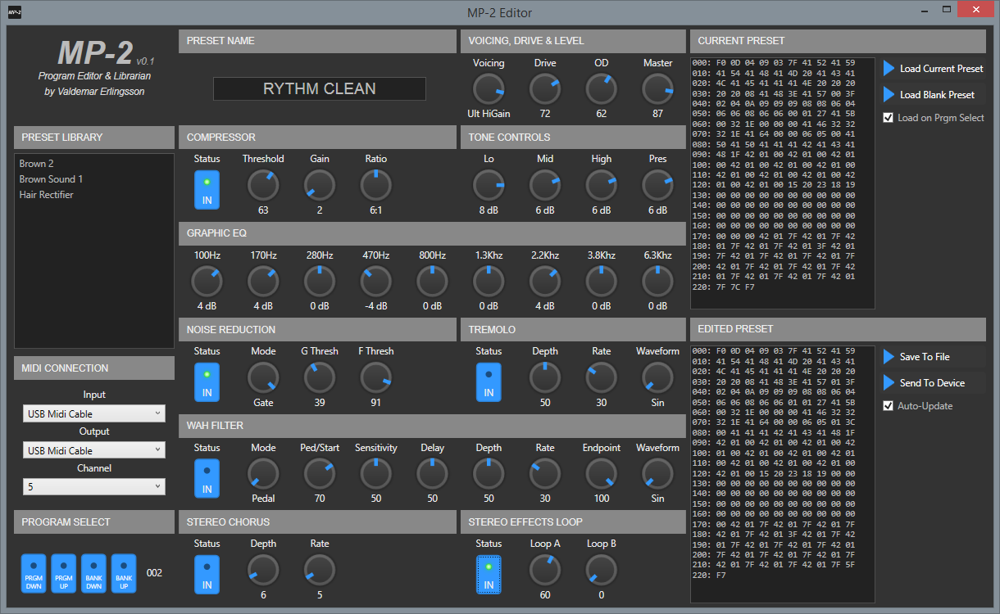

# ADA MP-2 Program Editor & Librarian

This is a Windows editor for the MP-2 Preamp. 

*Written by Valdemar Erlingsson.*

## Features

* Control all parameters that affect the sound 
* Send and receive programs via MIDI
* Archive and manage your sysex programs.
* Send Program Change messages
* Free and open source software

This editor can not edit the RTM (Real-time MIDI) settings of the unit.

## Download

Grab the latest version from the **[Releases Page](https://github.com/ValdemarOrn/Mp2Editor/releases)**.

This software requires .NET Framework 4.5 to operate. Most users on Windows 7 or newer will already have this installed, but it can be installed via the Windows Update panel, or [downloaded directly from Microsoft](https://www.microsoft.com/en-gb/download/details.aspx?id=30653)

## Video Introduction

## Reporting Issues

Your support would be appreciated. If you do find any issues with the software, please [raise an issue on Github](https://github.com/ValdemarOrn/Mp2Editor/issues) I will do my best to fix it.

The program logs a full error log into a subdirectory called "Error Logs". Attaching the log file to your issue will make it much easier to fix the problem.

## Sysex Protocol

In order to build the editor I had to reverse-engineer the sysex format used by ADA. Some work had already been done by members of the ADA Depot discussion board, I am very grateful for the work they had done, as it was the key cracking the rest of the format.

**[ADA Depot Discussion Thread](http://adadepot.com/index.php?topic=151.15)**

A full set of notes on how the MP-2 program sysex is laid out can be found **[here](https://github.com/ValdemarOrn/Mp2Editor/blob/master/SysexProtocol.xlsx)**